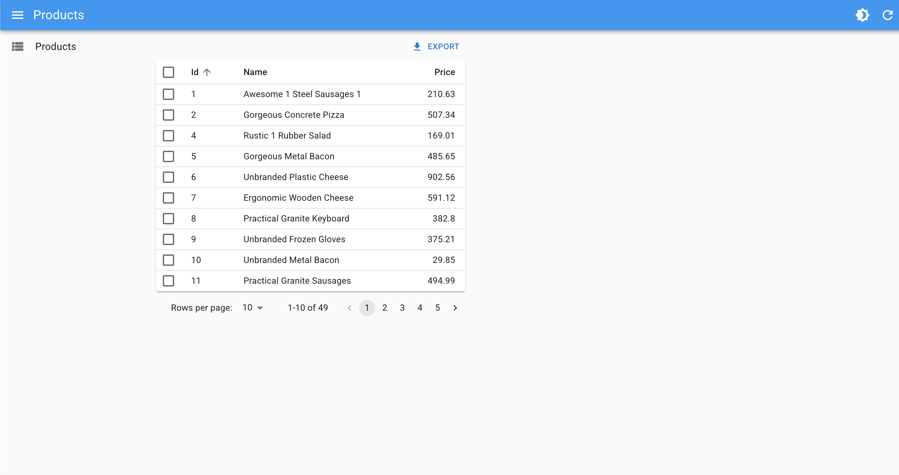

# Overview

Building a Project with NetCore + React Admin + SQlite + Realtime Update with SignalR

# Commands

```

-- Backend

dotnet new webapi -o backend
dotnet add package Microsoft.EntityFrameworkCore.Sqlite
dotnet add package Microsoft.EntityFrameworkCore.Tools
dotnet ef migrations add InitialCreate
dotnet ef database update
dotnet add package Bogus

-- Frontend 

npm create vite frontend --template react
npm i -S react-admin ra-data-simple-rest

-- Run Project

dotnet run
npm run dev

-- Get Products

http://localhost:5284/api/products

```

# Web Interface

http://localhost:5173/#/products



# Links

https://jsonplaceholder.typicode.com/

https://marmelab.com/react-admin/Vite.html

https://react-admin.github.io/ra-enterprise/?path=/story/ra-editable-datagrid-editabledatagrid--confirm-delete